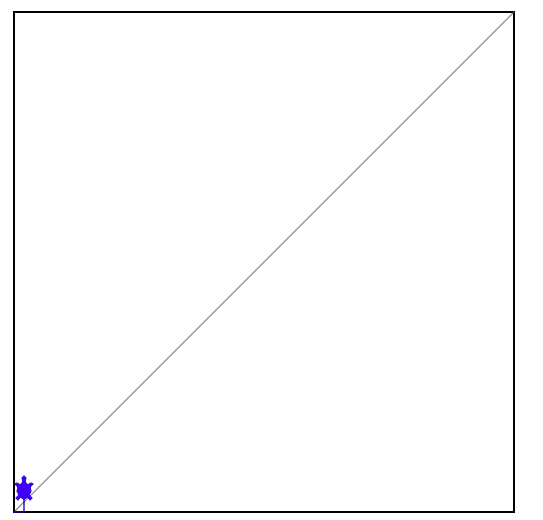

# 🐢 Draw ROC curve with turtle graphics



Code for drawing ROC curves with turtle graphics

## Algorithm

The turtle movement is governed by a simple algorithm:
- Sort the test samples based on the classifier score.
- Loop over them.
- If the label is positive, turtle goes up.
- If the label is negative, turtle goes down.

## Fun facts

- The path of a turtle is precisely the ROC curve of the classifier.
- Moreover, the average vertical distance is equal to the ROC AUC metric.

## Requirements

The requirements can be installed by
```
pip install -r requirements.txt
```
The key dependency is this [nice project](https://github.com/williamnavaraj/ipyturtle3) for using the turtle (which is a standard python library!) in tandem with jupyter notebooks. 

## Minimal example

- [Minimal example](notebooks/minimal_example.ipynb)
